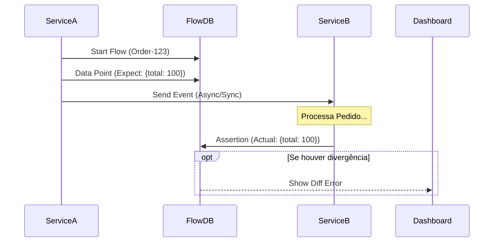

# Flow Framework

**Flow** é uma ferramenta de **Rastreabilidade Distribuída e Validação de Contratos (Contract Testing)** focada em testes E2E e integração de microsserviços.

Ela permite definir **Pontos de Expectativa (Points)** no início de um processo e **Asserções (Assertions)** conforme os eventos ocorrem em outros serviços, garantindo que o fluxo de dados entre sistemas distribuídos esteja correto e íntegro.

---

## 🚀 Funcionalidades Principais

- **Rastreamento de Fluxo (Distributed Tracing)**: Acompanhe a jornada de um dado (ex: Pedido) entre múltiplos serviços.
- **Validação de Contratos**: Garanta que o payload enviado pelo Serviço A chegou inalterado ou transformado corretamente no Serviço B.
- **Detecção de Falhas**: Identifique onde o fluxo parou ou se os dados foram corrompidos.
- **Dashboard em Tempo Real**: Visualize a timeline de execução, status e diffs de JSON.

---

## 🛠️ Arquitetura

O Flow funciona com base em dois conceitos principais:
1. **Points (Expectativa)**: O que *deveria* acontecer. Criado pelo serviço iniciador.
2. **Assertions (Realidade)**: O que *realmente* aconteceu. Criado pelos serviços consumidores.



---

## 📦 Instalação e Execução

### Pré-requisitos
- Docker & Docker Compose
- Go 1.18+

### 1. Iniciar Infraestrutura
Suba o banco de dados PostgreSQL:

```bash
make up
# ou
docker-compose up -d
```

### 2. Rodar o Dashboard
O dashboard permite visualizar os fluxos em tempo real.

```bash
make dashboard
# Acessar em: http://localhost:8585
```

### 4. Configuração

Para alterar as credenciais do banco ou porta do dashboard, edite o arquivo `flow.config.yaml` na raiz do projeto:

```yaml
db:
  host: 127.0.0.1
  port: 5432
  user: user
  password: password
  name: flow_db
server:
  port: 8585
```

### 3. Executar Exemplo (Simulação)

**Passo 1: Iniciar um Pedido (Service A)**
Isso cria um novo Flow e define um "Point" (Expectativa).
```bash
make run-a
# Saída: Starting flow 'ORDER-16626'...
```

**Passo 2: Processar o Pedido (Service B)**
Isso lê o evento e gera uma "Assertion" (Realidade).
```bash
make run-b
# Saída: Processing flow ORDER-16626... Assertion Created.
```

**Passo 3: Simular Conflito/Erro**
```bash
make run-a-conflict
# Gera um fluxo com ID fixo para testes de colisão ou interrupção.
```

---

## 💻 Como Usar a Lib (`pkg/flow`)

Importe o pacote no seu serviço Go:

```go
import "github.com/seu-repo/flow/pkg/flow"
```

### Iniciando um Fluxo (Service A)
```go
// 1. Iniciar o contexto do Flow
ctx := context.Background()
client := flow.NewClient(db)

// 2. Criar um novo rastreamento
f, _ := client.Start("ORDER-123")

// 3. Definir o que esperamos que aconteça (Point)
payload := map[string]interface{}{"amount": 100, "status": "pending"}
f.AddPoint("Wait for Payment", payload, "Service A")
```

### Validando um Fluxo (Service B)
```go
// 1. Recuperar o Flow existente
f, _ := client.Get("ORDER-123")

// 2. Registrar o que realmente aconteceu (Assertion)
actualPayload := map[string]interface{}{"amount": 100, "status": "paid"}
f.Assert(actualPayload, "Service B")

// O Flow comparará automaticamente o Point vs Assertion na ordem de chegada.
```

---

## 📊 Dashboard

O Dashboard oferece:
- **Timeline Visual**: Veja passo a passo a execução.
- **Diff de JSON**: Comparação visual entre *Expected* e *Actual*.
- **Status**: Identificação visual de Sucesso (✅), Falha (❌) ou Órfão (⚠).
- **Paginação Infinita**: Navegue or milhares de fluxos sem travar.


---

## 🧩 Boas Práticas e Desacoplamento

Para evitar "poluir" sua regra de negócio com código de infraestrutura de testes, recomendamos o uso de **Patterns de Desacoplamento**.

### Estratégia 1: Wrapper / Decorator
Crie uma interface para o Flow e injete-a no seu serviço. Se o Flow não estiver disponível (ex: produção), a implementação pode ser um "NoOp" (faz nada).

```go
type OrderFlow interface {
    TrackCreation(orderID string, amount float64)
}

type RealOrderFlow struct { client *flow.Client }

func (r *RealOrderFlow) TrackCreation(id string, amount float64) {
    f, _ := r.client.Start(id)
    f.CreatePoint("Order Created", map[string]interface{}{"id": id, "amount": amount})
}

// Na sua regra de negócio:
func (s *Service) CreateOrder(id string, amount float64) {
    // Lógica pura de negócio...
    
    // Observabilidade desacoplada
    s.flow.TrackCreation(id, amount)
}
```

### Estratégia 2: Middleware / Interceptor
Se você usa arquitetura baseada em eventos ou HTTP, pode injetar os pontos via Middleware, sem quem o handler saiba.

Exemplo em um consumidor (Kafka/RabbitMQ/SQS):
```go
func Middleware(next Handler) Handler {
    return func(msg Message) {
        // 1. Extrai ID e cria Assertion automaticamente baseada no payload
        f, _ := client.Get(msg.ID)
        f.Assert(msg.Payload, "Message Received")
        
        // 2. Chama a lógica de negócio
        next(msg)
    }
}
```

Isso garante que seu domínio (`core/domain`) permaneça agnóstico à ferramenta de testes.

**Veja exemplos completos:**
- 📂 [Desacoplamento via Service Wrapper](examples/decoupled/main.go)
- 📂 [Middleware de Mensageria](examples/middleware/messaging.go)
- 📂 [Clean Architecture (Zero Acoplamento)](examples/clean_architecture/main.go)

### Estratégia 3: Clean Architecture (Zero Acoplamento)
Neste modelo, seu caso de uso (`UseCase`) define apenas uma interface de notificacão (ex: `OrderObserver`). A implementação concreta que chama o `flow-tool` fica na camada de infraestrutura.

**Arquivos:**
1.  **Domain**: `type OrderObserver interface { OnCreated(order) }` (Sem imports)
2.  **UseCase**: `observer.OnCreated(order)` (Usa a interface)
3.  **Infra**: `type FlowAdapter struct {}` (Implementa e chama a lib)

Seu código de negócio fica 100% livre da biblioteca. Veja o exemplo acima na pasta `clean_architecture`.
